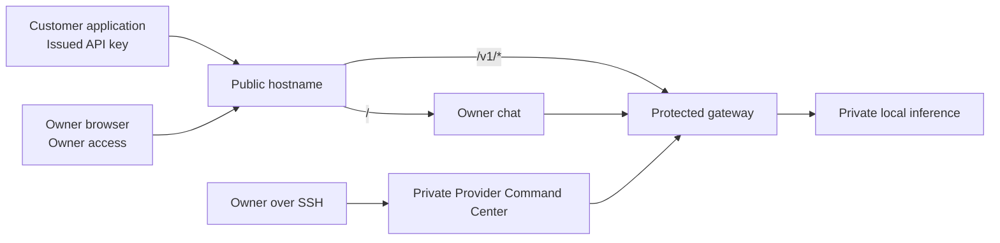

# Mattr Labs Local LLM Provider

An **invite-only, single-model LLM API pilot** running on private local hardware. The service provides an OpenAI-compatible streaming API for approved users, a private owner chat, and an SSH-only Provider Command Center for customer-key and operations management.

> This repository intentionally contains **no raw API keys, access tokens, passwords, tunnel credentials, private configuration files, customer prompts, or customer answers**. Keep all secrets in the host's private environment and never commit them.

## Current status

The core provider service is live. The public hostname serves a protected API at `/v1/*` and an owner-only chat interface at `/`. The raw inference runtime and private operations console are not publicly exposed.

| Surface | Availability | Purpose |
|---|---|---|
| Owner chat | `https://google.mattrlabs.online/` | Private browser chat for the service owner. It requires owner access and is not a public customer chat product. |
| Customer API | `https://google.mattrlabs.online/v1` | OpenAI-compatible text generation for users with an issued API key. |
| Model alias | `gemma-e2b` | The supported public model name for API requests. |
| Provider Command Center | Private, SSH-only | Customer keys, safe usage metadata, capacity, request activity, and launch-safety guidance. |
| Load Lab | Private, SSH-only | Multi-user load, fairness, and capacity testing. |

## Public API quick start

An approved user receives an individual API key once through a private channel. Use it as a bearer credential; do not put it in source code, screenshots, or public issue reports.

```bash
curl -N https://google.mattrlabs.online/v1/chat/completions \
  -H "Content-Type: application/json" \
  -H "Authorization: Bearer YOUR_ISSUED_API_KEY" \
  -d '{
    "model": "gemma-e2b",
    "stream": true,
    "max_tokens": 128,
    "messages": [
      {"role": "user", "content": "Reply with one concise sentence."}
    ]
  }'
```

The service uses standard server-sent events for streaming. An invalid, expired, or revoked key receives `401`. The system can return `429` when a key is already generating or the shared model capacity is full.

## Operating boundaries

The product deliberately separates customer use from private operations.



| Boundary | Rule |
|---|---|
| Customer authentication | Every customer uses a separate issued API key. The server stores only safe key metadata and a protected verifier, never the raw customer secret. |
| Capacity fairness | The service allows one active generation per customer key and four active generations across the host. Excess interactive requests are rejected clearly rather than silently queued. |
| Model privacy | The inference runtime remains private and is never directly exposed as a public internet service. |
| Owner operations | The Provider Command Center, metrics, and Load Lab are SSH-only. They are not available from the public hostname. |
| Chat privacy | Owner chat history is local to the active browser session. It is not a customer transcript platform. |
| Telemetry privacy | Gateway telemetry records safe operational metadata such as timing, status, and usage counts; prompt and answer text are not retained by default. |

## What the Provider Command Center does

The private console is the owner operating surface. It includes:

| Area | Purpose |
|---|---|
| Overview | Gateway health, active capacity, key counts, daily usage, and recent outcomes. |
| Provider launch | Live service map, customer API quick-start, and pre-invite safety gates. |
| Customers & keys | Create an individual customer key, reveal it once, inspect safe metadata, and revoke access by key prefix. |
| Request activity | Inspect safe request metadata including status, latency, output count, and policy outcomes. |
| Load Lab | Run controlled local capacity and fairness tests. |

## Known scope and limits

This is intentionally a narrow pilot. It currently provides one text model and manually issued access keys. It does **not** yet include customer self-signup, billing, customer accounts, persistent customer conversation history, file uploads, agent tools, multiple public models, uptime guarantees, or a public admin panel.

Before inviting additional external users, complete the critical operating work described in the [provider gap register](docs/PROVIDER_GAP_REGISTER.md): rotate any exposed test keys, add Cloudflare edge rate rules, verify a fresh authenticated public stream, set up tested backups, and add basic alerting.

## Repository layout

| Location | Description |
|---|---|
| [`gateway/`](gateway/) | Protected API gateway, key controls, policy enforcement, SQLite metadata ledger, and command-line operations. |
| [`client/`](client/) | React interfaces for the owner chat, Provider Command Center, and Load Lab. |
| [`server/`](server/) | Same-host router and private proxies that keep browser surfaces separate from protected server credentials. |
| [`docs/`](docs/) | Architecture, runbooks, benchmark evidence, provider service map, and current readiness gap register. |
| [`test/`](test/) | Same-host routing acceptance test. |

## Safe development checks

Install dependencies and run validation from a trusted development environment:

```bash
pnpm install
pnpm chat:build
pnpm check
pnpm gateway:test
pnpm chat:test
```

Do not add secret environment files, database files, generated runtime logs, raw API keys, Cloudflare credentials, or private host configuration to Git.

## Documentation map

| Document | Use it for |
|---|---|
| [Provider service map](docs/PROVIDER_SERVICE_MAP.md) | Complete picture of live chat, customer API, owner operations, and the intended product model. |
| [Provider gap register](docs/PROVIDER_GAP_REGISTER.md) | Prioritized interface, API, admin, security, operations, and commercial-readiness gaps. |
| [Gateway administrator runbook](docs/ADMIN_RUNBOOK_MAC_MINI_GATEWAY.md) | Owner-only gateway operations, customer-key management, testing, and recovery guidance. |
| [Private Owner Console](docs/PRIVATE_OWNER_CONSOLE.md) | SSH-only console access and operational workflow. |
| [Same-host owner chat blueprint](docs/SAME_HOST_OWNER_CHAT_BLUEPRINT.md) | Public-path routing contract and owner-chat security boundary. |
| [Same-host owner chat runbook](docs/SAME_HOST_OWNER_CHAT_RUNBOOK.md) | Local owner-chat setup, verification, and controlled routing changes. |
| [Gemma capacity benchmark](docs/BENCHMARK_GEMMA_E2B_MAC_MINI.md) | Measured capacity baseline and concurrency evidence. |
| [Phase 1 gateway blueprint](docs/PHASE1_PROTECTED_GATEWAY_BLUEPRINT.md) | Detailed protected-gateway policy, capacity, security, and telemetry design. |

## Contribution and security reporting

Use issues and pull requests for non-sensitive changes. Do not report secrets, customer details, access tokens, raw API keys, or security vulnerabilities in public GitHub issues. Share sensitive reports privately with the repository owner.
