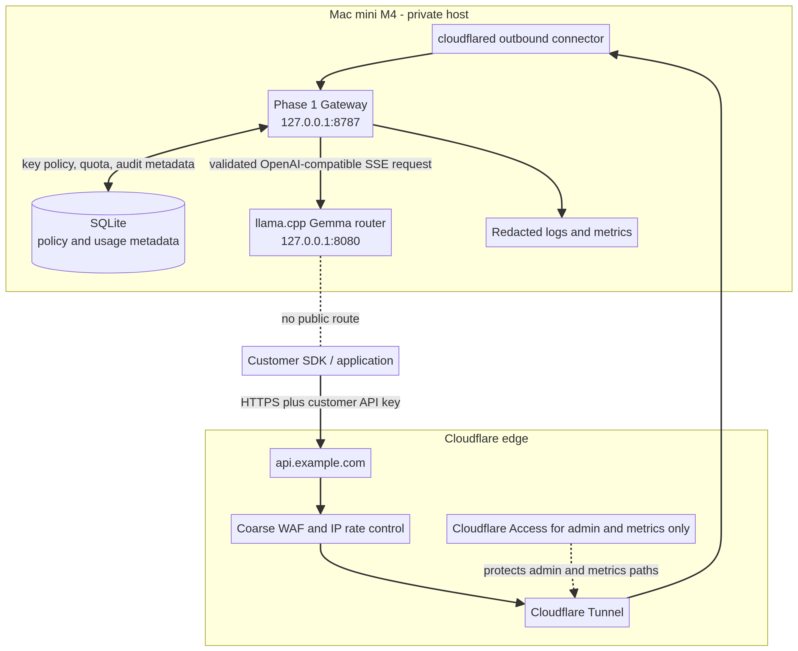

# Phase 1 protected gateway blueprint for Gemma E2B llama.cpp

**Author:** Manus AI  
**Status:** Architecture blueprint — implementation has not started  
**Selected inference model:** `ggml-org/gemma-4-E2B-it-GGUF:Q8_0`  
**Measured host:** Mac mini M4 with 16 GB unified memory

## 1. Objective and non-negotiable boundary

Phase 1 turns the Phase 0 local model endpoint into a **small invited-user API**, without exposing llama.cpp directly to the Internet. The protected gateway becomes the single public policy-enforcement point. Customers receive only a documented OpenAI-compatible API; they never receive the raw llama.cpp address, the Cloudflare tunnel credential, the model-management API, or the gateway administrator key.

The Phase 0 benchmark is the starting contract. Under the measured 8K-context long-answer workload, Gemma sustained **four active requests**. The fifth request queued materially, with first meaningful output delayed by roughly 65 seconds. Therefore, the gateway must enforce fairness *before* requests reach llama.cpp.

> **Initial operating rule:** A maximum of **four global active generations** and **one active generation per customer API key**. The fifth interactive request must receive a clear retry response or enter a separate, explicit asynchronous queue; it must never wait invisibly in the HTTP request path.

## 2. Recommended deployment choice

The table presents two viable Phase 1 approaches. The first is recommended because the service starts with one Mac mini, one selected model, a small invited-user set, and a strict capacity ceiling.

| Approach | Tradeoffs | Cost | Setup complexity |
|---|---|---:|---:|
| **Purpose-built local gateway with SQLite** — recommended | A small Node.js gateway enforces API keys, concurrency, quotas, request validation, SSE proxying, and logging. It has the fewest moving parts, but advanced multi-team billing and automatic spend accounting must be added later. | No new service required. | Moderate. |
| **LiteLLM Proxy with PostgreSQL** | LiteLLM offers virtual keys, key-level limits, model aliases, and spend/key management, but it introduces a database, a master key, and more operational surface. It is better when you have many tenants or multiple providers/models. [4] | Database and operations cost may apply. | Higher. |

The selected Phase 1 architecture uses the **purpose-built local gateway**. It is deliberately designed so that a later LiteLLM migration is possible without changing customer URLs or request schemas.

## 3. Architecture

### Public and private boundaries

| Zone | Components | Exposure rule |
|---|---|---|
| **Customer edge** | Customer SDK or application, Cloudflare DNS and WAF/rate rules | Customer traffic enters only through `https://api.example.com`. |
| **Private access edge** | Cloudflare Tunnel and a separate Cloudflare Access application | Access protects administration and metrics endpoints; its service tokens are for operator/automation access, not a substitute for customer API keys. [1] [2] |
| **Mac mini gateway zone** | `cloudflared`, Phase 1 gateway, local SQLite database, structured logs | `cloudflared` forwards only to the gateway loopback address. No inbound firewall port is opened. [1] |
| **Inference zone** | llama.cpp router and selected Gemma model | Bound to `127.0.0.1` only. It accepts requests only from the local gateway. Never add it as a Cloudflare Tunnel public hostname. |

Cloudflare Tunnel uses outbound-only connections, which lets the Mac remain without a publicly routable inbound service. [1] This reduces origin-bypass exposure but does **not** replace gateway authentication, quota enforcement, or request validation.

## 4. Host processes and local bindings

| Process | Example bind | Responsibility | Must never be public |
|---|---|---|---|
| `llama` router | `127.0.0.1:8080` | Loads Gemma and generates SSE responses. | Yes — loopback only. |
| `llm-gateway` | `127.0.0.1:8787` | Authenticates customers, applies policy, queues/rejects, proxies SSE, and writes metrics. | Yes — loopback only. |
| `cloudflared` | Outbound connector | Maps `api.example.com` only to `http://127.0.0.1:8787`. | It is the sole public ingress path. |
| SQLite | Local file with owner-only permissions | Stores hashed API keys, policy metadata, aggregates, audit events, and request metadata. | Never exposed through HTTP. |

Use `launchd` service definitions for `llama`, `llm-gateway`, and `cloudflared`. Each service should restart after a crash with a bounded restart delay and write to a separate rotating log file. Do not rely on an open SSH terminal or browser tab to keep a process alive.

## 5. Gateway request flow

1. A customer sends `POST /v1/chat/completions` to `https://api.example.com` with `Authorization: Bearer <customer-key>`.
2. Cloudflare performs coarse edge filtering, TLS termination, and volumetric/rate protections. Edge rate limiting is useful for abuse reduction but is not precise enough to protect a four-slot model because enforcement counters can lag by seconds. [3]
3. `cloudflared` forwards the request to the loopback-only gateway.
4. The gateway assigns a random trace ID and validates method, content type, request-body size, JSON shape, model alias, message count, character/token estimate, requested output budget, and timeout.
5. The gateway hashes the provided API key using a server-side pepper, finds the key record, checks revocation/expiry, and loads its plan limits. It never stores or logs the raw customer secret.
6. The gateway checks the per-key active limit (`1`), per-key request bucket, daily token/request allowance, and global active count (`4`).
7. If admitted, the gateway reserves the key and global slots, records `queued_ms = 0`, and forwards a sanitized OpenAI-compatible request to `http://127.0.0.1:8080/v1/chat/completions`.
8. The gateway relays the SSE response without buffering the entire generation. It measures response-start time, first meaningful stream time, final completion reason, output count when supplied, elapsed time, and disconnect/error status. For Gemma, the first meaningful text may be `delta.reasoning_content` before `delta.content`.
9. On stream completion, cancellation, timeout, or backend error, the gateway releases both slots in a `finally` path and writes a request-metadata record.
10. The gateway returns only the standard response/SSE stream and a non-sensitive `X-Request-Id`. It does not return queue internals, stack traces, server paths, or model-management details.

### Interactive overload behavior

| Condition | Gateway response | Model call made? | Reason |
|---|---|---:|---|
| Valid key; fewer than four global active requests; key inactive | Admit and stream. | Yes | Normal operation. |
| Same key already has one active generation | `429` with code `key_concurrency_exceeded`. | No | Prevents one customer from consuming all slots. |
| Four global active generations | `429` with code `capacity_busy`, `Retry-After: 15`. | No | Protects interactive TTFT from the measured fifth-request queue. |
| Optional async endpoint queue full or job expired | `429`/`503` with job-specific error. | No | Avoids unbounded in-memory work. |
| llama.cpp unavailable or selected model unloaded | `503` with code `inference_unavailable`. | No/failed health check | Gives a deterministic, safe error. |

Use `429` for an expected customer-specific or capacity limit. Use `503` when the local inference service is unhealthy. Do **not** automatically retry a generation after bytes have been streamed; that can duplicate an answer and usage. A client may use an idempotency key only before the gateway dispatches the first backend request.

## 6. Initial policy configuration

These settings are conservative starting values, not permanent commercial plans. The global active cap is directly based on Phase 0 evidence. Other limits should be measured and revised after an invited alpha.

| Policy dimension | Initial value | Rationale |
|---|---:|---|
| Public model alias | `gemma-e2b` | Customers request an alias, not the llama.cpp internal model name. This allows future internal migration. |
| Allowed backend model | `ggml-org/gemma-4-E2B-it-GGUF:Q8_0` | Fixed selected model. Reject all other model IDs. |
| Global active generations | **4** | Measured active-capacity boundary for long 8K-context workloads. |
| Active generations per API key | **1** | Fairness rule: one customer cannot occupy all four active slots. |
| Interactive queue | **Disabled** | Return `429` at global capacity instead of hiding a 65+ second wait. |
| Async queue, if added | Maximum 20 jobs, 5-minute queue TTL | Separate endpoint and explicit job status. Do not add until there is a real batch-work need. |
| Default maximum output | 512 tokens | Protects interactive latency and limits runaway reasoning. |
| Long-output maximum | 2,048 tokens, a separate plan/endpoint | Requires a lower request-rate allowance and customer disclosure. |
| Absolute output maximum | 8,192 tokens | Model context ceiling; do not offer as a standard public interactive tier initially. |
| Maximum request body | 256 KiB | Stops oversized payload abuse before parsing. |
| Maximum messages | 64 | Prevents oversized conversation arrays. |
| Maximum input characters | 24,000 characters initially | Conservative proxy for context use; replace with a real tokenizer estimate in a later revision. |
| Normal request timeout | 120 seconds | Appropriate for small interactive responses. |
| Long request timeout | 300 seconds | Available only to a long-output plan or async job. |
| Per-key request rate | 6 requests/minute; burst 2 | Coarse first control; concurrency and output budgets are the more important safeguards. |
| Daily allowance | Start with 50 standard requests or a configurable token allowance | Keep early customer use bounded while you learn actual demand. |

The gateway must enforce all of these values itself. Cloudflare rate rules are additional edge protection, not the concurrency authority, because Cloudflare documents that rate counter updates may lag and extra requests may reach an origin before mitigation. [3]

## 7. Authentication, authorization, and secrets

### Customer API keys

Generate a random 32-byte secret and display it once. Use a visible non-secret prefix such as `gma_live_` for support identification. Store a deterministic keyed hash, for example `HMAC-SHA-256(server_pepper, raw_key)`, not the raw key. The database record stores the key prefix, hash, tenant ID, state, allowed model aliases, limits, expiry, and revocation timestamp.

| API-key state | Gateway action |
|---|---|
| Active and within limits | Allow eligible request. |
| Expired, revoked, or disabled | Return `401` or `403`; do not contact llama.cpp. |
| Model not allowed | Return `403`; do not allow raw model names. |
| Active request already in flight | Return `429`; do not queue interactive work. |

The gateway administrator key is separate from customer keys. It must be in a local owner-only environment file or macOS key store and must never travel through the customer hostname.

### Cloudflare Access boundaries

Protect **administrative endpoints** such as `/admin/*`, `/metrics`, `/keys/*`, and `/health/private` behind a separate Cloudflare Access application. Use human identity login for operator access and service tokens for approved automation. Cloudflare service tokens are a Client ID/Client Secret pair, support expiry/renewal/revocation, and can authenticate to Access-protected applications. [2]

Do not require Cloudflare Access service tokens from ordinary customer SDKs in the first public API design. That adds a second credential scheme and complicates compatibility. Use customer gateway keys for `api.example.com`; use Cloudflare Access for the **admin** hostname or admin path.

### Secrets inventory

| Secret | Stored where | Rotation/revocation rule |
|---|---|---|
| Customer API-key raw value | Shown once to customer; never stored locally. | Replace by issuing a new key; revoke old hash immediately. |
| Gateway hash pepper | Owner-only local environment file or macOS Keychain. | Rotate with a staged key-rehash migration. |
| Gateway admin key | Owner-only local secret store. | Manual rotation; never send to browser or customer client. |
| llama.cpp internal API key | Owner-only local environment file; gateway only. | Rotate with gateway and llama restart. |
| Cloudflare Tunnel credential | `cloudflared` credential file with owner-only permission. | Rotate/revoke in Cloudflare if host compromise is suspected. |
| Cloudflare Access service tokens | Cloudflare dashboard plus operator secret store. | Set expiry alerts; revoke individually on loss. [2] |

## 8. Request validation and LLM-specific safety boundary

The gateway is not a universal prompt-injection filter. A user controls their own prompt and can ask the model undesirable questions; do not claim that authentication removes LLM risk. OWASP identifies prompt injection, insecure output handling, model denial of service, sensitive information disclosure, insecure plugin design, and excessive agency as important LLM risks. [5]

The safest Phase 1 boundary is intentionally narrow:

| Allow in Phase 1 | Explicitly do **not** allow in Phase 1 |
|---|---|
| Text-only `/v1/chat/completions` | Tools, MCP, shell actions, plugins, browser actions, arbitrary local file access. |
| Streaming and non-streaming generation | Customer-selected raw llama.cpp model names. |
| Bounded conversation messages | Image uploads, audio uploads, embeddings, reranking, arbitrary file URLs. |
| Fixed model alias and bounded output | Gateway pass-through of custom server flags, tool schemas, or an unbounded `max_tokens`. |

The gateway must strip unsupported fields, reject tool/function requests, reject attachments, and use a strict allow-list of routes. Keep llama.cpp agent/tool features disabled. Validate downstream consumers of model output; never directly execute returned code, URLs, SQL, shell commands, or tool-like JSON. [5]

## 9. Data model, retention, and observability

SQLite is sufficient for the initial single-host pilot if only the gateway process writes to it. Enable write-ahead logging, daily encrypted backups, and owner-only permissions. Move to PostgreSQL only when multiple gateway instances, richer tenant administration, or more sophisticated reporting becomes necessary.

| Table/entity | Minimum fields | Privacy rule |
|---|---|---|
| `tenants` | `id`, `display_name`, `status`, `created_at` | No customer content. |
| `api_keys` | `id`, `tenant_id`, `prefix`, `secret_hash`, `limits`, `expires_at`, `revoked_at` | Never store raw secret. |
| `request_events` | `request_id`, `key_id`, `model_alias`, `started_at`, `queued_ms`, `ttft_ms`, `elapsed_ms`, `finish_reason`, `requested_output`, `reported_output`, `status_code`, `error_code` | No prompt or response text by default. |
| `daily_usage` | `tenant_id`, `date`, `requests`, `reported_input_tokens`, `reported_output_tokens` | Aggregated only. |
| `admin_audit` | `actor`, `action`, `target`, `timestamp`, `result` | Never log admin or customer secrets. |

By default, do **not** retain prompt content or streamed answers. If a future support process needs temporary debugging, make it opt-in, encrypt it, restrict operator access, and define a short deletion window. Redact `Authorization`, Cloudflare access headers, cookies, raw API keys, and full request bodies from all application and proxy logs.

### Required metrics

| Metric | Why it matters |
|---|---|
| `gateway_inflight_global` | Must never exceed 4. |
| `gateway_inflight_by_key` | Detects fairness enforcement. |
| `gateway_rejected_total{reason}` | Separates rate, key, body, output, and capacity rejection causes. |
| `gateway_queue_depth` | Must remain 0 for interactive endpoint. |
| `gateway_ttft_ms` | Best customer-experience signal. |
| `gateway_elapsed_ms` | Detects slow workloads and timeout trends. |
| `gateway_finish_reason_total` | Reveals answer truncation by `length`. |
| `gateway_backend_errors_total` | Detects llama.cpp/model health failures. |
| Host memory pressure and process restarts | Detects exhaustion before it becomes an outage. |

## 10. Network and HTTP policy

Only publish the customer gateway hostname through Cloudflare Tunnel. Cloudflare Tunnel creates outbound connections from the origin and can be used while blocking inbound access to the origin. [1]

| Endpoint group | Public hostname exposure | Customer auth | Cloudflare Access | Notes |
|---|---|---|---|---|
| `POST /v1/chat/completions` | `api.example.com` | Required customer API key | No for normal customers | OpenAI-compatible customer route. |
| `GET /v1/models` | Same hostname, limited response | Required customer API key | No | Return only `gemma-e2b`, not internal router model list. |
| `/admin/*`, `/metrics`, key management | `admin-api.example.com` or separate protected path | Administrator key plus operator role | Required | No customer access. |
| `/healthz` | Local only or Access-protected | None locally | Required if remote | Never publish full internal diagnostics. |
| llama.cpp `:8080` | None | Gateway internal key only | N/A | No Tunnel mapping; loopback only. |

At the edge, configure a coarse Cloudflare rate rule for the customer route by IP as an abuse brake, for example a small burst threshold per minute. Keep the precise key-based limits in the gateway. Cloudflare rate rules require a match expression, characteristics, period, request threshold, mitigation duration, and action; their counters are intentionally not a precise origin admission control. [3]

## 11. Resilience and recovery

| Failure | Gateway behavior | Operator response |
|---|---|---|
| llama.cpp process down | Open circuit; return `503 inference_unavailable`; do not queue unbounded work. | `launchd` restarts process; check selected Gemma model and local `/v1/models`. |
| Model unexpectedly unloads | Return `503` until readiness check succeeds. | Load/verify selected model locally; do not accept queued interactive requests. |
| Gateway process restarts | In-flight streams end; new requests recover after health check. | Keep no request queue only in RAM for interactive traffic; record incomplete request event. |
| Cloudflare Tunnel disconnected | Local model remains private; public requests fail at edge. | Alert on tunnel health; no direct public fallback to port 8080. |
| SQLite locked/corrupt | Fail closed for new keys/usage writes; return `503` rather than bypassing policy. | Restore encrypted backup and investigate disk/permissions. |
| Customer key exposed | Revoke hash, issue replacement, review request events by key ID. | Do not attempt to recover the old raw key. |
| Abuse/high output demand | Reject at gateway limit and edge rate rules. | Tune the customer plan only after repeat capacity tests. |

## 12. Implementation order

### Stage 1 — local-only gateway

Build the gateway on the Mac mini with no public hostname. Point it to `http://127.0.0.1:8080`, add one local test key, and run the existing dashboard against `http://127.0.0.1:8787/v1`. Confirm that the gateway, not the browser, records the active count, per-key limit, and output policy.

### Stage 2 — enforcement tests

Run the acceptance tests below. Do not create a public tunnel hostname until all pass.

### Stage 3 — edge publication

Create a Cloudflare Tunnel mapping only for the gateway. Add the admin Access application and service-token policy. Add an initial edge rate rule. Verify that `https://api.example.com/v1/models` reaches the gateway, while direct access to `:8080` from outside fails.

### Stage 4 — invited alpha

Create one key per invited user. Start with a low number of users, no long-output 8K tier, no tools, no file input, and no credit card or billing promises. Review metrics daily and adjust only one policy variable at a time.

## 13. Phase 1 acceptance tests

| Test | Expected outcome |
|---|---|
| Valid key, one request | Streams Gemma response; metrics record TTFT and final completion. |
| Four different valid keys, one long request each | Four requests admitted; all have expected streaming behavior. |
| Fifth valid key while four are active | `429 capacity_busy`, no llama.cpp request made. |
| Two simultaneous requests with same key | Second receives `429 key_concurrency_exceeded`; no backend call. |
| Invalid, expired, or revoked key | `401`/`403`, no backend call, no existence details leaked. |
| Output over plan maximum | `422` before backend call. |
| Oversized JSON payload or excessive messages | `413`/`422` before parsing into model request. |
| Requested tools, functions, images, or raw model ID | `422`/`403`, no backend call. |
| llama.cpp stopped | Gateway returns controlled `503`; it does not hang or expose internal error text. |
| Tunnel public URL | Gateway works with valid customer key only; raw port 8080 remains unreachable. |
| Admin hostname without Cloudflare Access | Denied at edge. |
| Logs inspection | No customer secret, Cloudflare secret, prompt, or answer text appears by default. |
| Gateway restart | New requests recover; stale active counters do not remain permanently reserved. |

## 14. Explicitly deferred from Phase 1

Do not add these until the small text-only service is stable: customer self-sign-up, automated payment collection, tool execution, file/image input, retrieval augmentation, multiple public models, public chat UI, anonymous access, function calling, browser agents, customer-managed webhooks, and a hidden interactive queue.

## References

## Visual verification note

The companion architecture diagram was rendered and checked after the final layout revision. It clearly separates the customer, Cloudflare edge, and private Mac mini zones; shows the gateway as the only public-to-private forwarding target; and marks the llama.cpp router as having no public route.

[1]: https://developers.cloudflare.com/cloudflare-one/networks/connectors/cloudflare-tunnel/ "Cloudflare Tunnel documentation"

[2]: https://developers.cloudflare.com/cloudflare-one/access-controls/service-credentials/service-tokens/ "Cloudflare Access service tokens"

[3]: https://developers.cloudflare.com/waf/rate-limiting-rules/ "Cloudflare rate limiting rules"

[4]: https://docs.litellm.ai/docs/proxy/virtual_keys "LiteLLM Proxy virtual keys"

[5]: https://owasp.org/www-project-top-10-for-large-language-model-applications/ "OWASP LLM application security risks"

[6]: https://owasp.org/API-Security/editions/2023/en/0xa4-unrestricted-resource-consumption/ "OWASP API4:2023 Unrestricted Resource Consumption"
