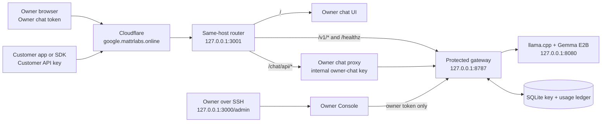

# Mattr Labs Local LLM Provider — Service Map and Product Plan

## Purpose

This document puts the existing system into one product picture. The Mac mini is no longer just a local model test machine: it already operates as a **small, invite-only LLM API provider** with a private owner chat and a private operations console. The next work is not to replace those systems. It is to make the customer API, owner operations, usage controls, and developer experience feel like one deliberate provider product.

> The first commercial model should remain deliberately narrow: **one text model, invited API users, clear limits, private operations, and no billing promise until capacity and support practices are proven.**

## 1. What is live today

| Surface | Address | Who uses it | Current purpose | Status |
|---|---|---|---|---|
| Owner chat | `https://google.mattrlabs.online/` | You, using the owner-chat token | ChatGPT-style private conversation with Gemma | Live |
| Customer API | `https://google.mattrlabs.online/v1/chat/completions` | Any customer holding an active `gma_live_...` key | OpenAI-compatible text completion and SSE streaming | Live |
| Models endpoint | `https://google.mattrlabs.online/v1/models` | API customers with a valid key | Exposes the supported public alias | Live |
| Gateway health | `https://google.mattrlabs.online/healthz` | Operational public check | Confirms gateway and backend reachability | Live |
| Owner Console | `http://127.0.0.1:3000/admin` through SSH tunnel | You only | Create/revoke keys, see usage, capacity, key records, and activity | Live and private |
| Load Lab | `http://127.0.0.1:3000/lab` through SSH tunnel | You only | Capacity and fairness testing | Live and private |
| Protected gateway | `127.0.0.1:8787` | Router only | API authentication, policy, fairness, SSE relay, usage events | Live and loopback-only |
| llama.cpp | `127.0.0.1:8080` | Gateway only | Gemma model inference | Live and loopback-only |

## 2. How the parts connect



The public hostname now has two safe roles. At `/`, it serves the **owner-only** chat interface. At `/v1/*`, it serves the **customer API**. The router keeps those path groups separate. The browser chat never sees the internal gateway key, and customers never see the owner token or the gateway administrator token.

## 3. The small API-key service did not disappear

The small key service is the protected gateway. It is the actual provider layer behind the public API.

| Customer-key capability | What the gateway already does |
|---|---|
| Issue a customer key | The Owner Console or local key CLI creates a `gma_live_...` key and shows its raw value once. |
| Protect the raw secret | Only a server-side keyed hash is stored in SQLite. |
| Revoke a key | The owner can revoke by safe visible prefix; new requests fail immediately. |
| Separate customer limits | Each key has its own request rate, daily allowance, output limit, expiry, and allowed model alias. |
| Prevent one user taking the machine | A key may run one generation at a time; all customers together may run four. |
| Handle overload honestly | A fifth active request receives `429 capacity_busy`, rather than waiting in an invisible queue. |
| Stream responses | The gateway relays standard OpenAI-compatible SSE responses. |
| Track usage safely | It records timing, output counts, policy outcomes, and request events without retaining prompts or answers by default. |

### Current customer API contract

```text
Base URL: https://google.mattrlabs.online/v1
Model alias: gemma-e2b
Authentication: Authorization: Bearer gma_live_...
Main route: POST /chat/completions
```

The API is already suitable for small invite-only integrations. A customer can use it from an OpenAI-compatible client by pointing the base URL at the address above and providing their issued key.

## 4. Where the complete admin/test page is

The proper owner operations page is intentionally **not public**. Open it from the Windows laptop through an SSH tunnel:

```powershell
ssh -N -L 3000:127.0.0.1:3000 mac
```

Then visit:

```text
http://127.0.0.1:3000/admin
```

The Owner Console uses a separate owner token. It currently provides three important operational views.

| Owner Console area | What it is for |
|---|---|
| Overview | Gateway health, active generation slots, capacity, daily usage, key counts, and recent outcomes. |
| Customers & keys | Create an individual customer key, reveal it once, inspect non-secret key metadata, and revoke it by prefix. |
| Request activity | See request status, latency, output count, errors, and policy outcomes such as `429 capacity_busy`. |

The separate **Load Lab** is still available on the private port-3000 workspace. It is for testing the four-slot model limit, not for customer administration.

## 5. What is intentionally not built yet

The following are product features, not missing security basics. They should be added in a controlled order.

| Not yet present | Why it is deferred | Recommended next action |
|---|---|---|
| Customer accounts and login | Requires identity, password/SSO policy, data isolation, and support flows. | Start with owner-issued invite keys, not self-sign-up. |
| Customer self-service portal | Requires accounts plus secure one-time key rotation and usage views. | Build only after invited users are actively using the API. |
| Billing and checkout | A four-slot host needs measured plans and support rules before charging. | Begin with manual invite plans and manual invoices, if needed. |
| Persistent customer chat history | Requires user accounts, a transcript-retention policy, and database isolation. | Keep current owner chat browser-session-only. |
| Multiple public models | Adds scheduling, memory isolation, model selection, and pricing complexity. | Keep `gemma-e2b` as the single public alias first. |
| File upload, tools, or agents | Greatly increases security and resource risk. | Keep the first provider API text-only. |
| Public admin panel | Would enlarge the attack surface. | Keep Owner Console SSH-only or later place a separate admin hostname behind Cloudflare Access. |

## 6. Recommended provider product shape

The product should be presented as a simple **invite-only local inference provider** rather than a generic “AI platform.” That makes the capacity promise honest and keeps operations manageable.

| Product layer | First provider version | Later version, after real demand |
|---|---|---|
| Public site | Short landing page plus API documentation and request-access form/email | Full developer portal and account onboarding |
| Customer offering | One `gemma-e2b` API key per invited user | Multiple model plans and customer projects |
| Usage model | Clearly stated limits: one active request/key, four global, bounded output | Plan-based token/request bundles and controlled overages |
| Support | Manual key issue/revoke and direct support | Self-service key rotation, team members, audit logs |
| Owner operations | Private Owner Console and Load Lab | Cloudflare Access-protected command center, alerts, backups |
| Billing | Manual only, if any | Payment provider after policy, limits, and customer demand are validated |

## 7. The next build order

### Milestone A — Make current operations feel like one provider console

This is the immediate next build. Keep the current private Owner Console, but organize it as a **Provider Command Center**.

1. Add a single service-status view for chat router, gateway, model backend, Cloudflare route, and current four-slot capacity.
2. Rename and group the key controls as **Customers**, **API keys**, **Usage**, and **Request activity**.
3. Add plan presets such as `Invite`, `Owner`, and `Long output`; the gateway remains the source of truth for enforcement.
4. Add an explicit “issue key” workflow with copy-once, expiry, safe prefix, and revoke guidance.
5. Add a launch checklist card: key rotation, edge rate rule, service health, backup status, and latest capacity check.

### Milestone B — Give customers a real developer experience

1. Publish a small public developer page at a dedicated route with the base URL, model alias, streaming example, error meanings, and request-access instructions.
2. Keep customer access invite-only. Do not put the Owner Console or Load Lab on the public route.
3. Give each invited customer a tenant label, a key, an expiry date, a clear standard limit, and a support channel.
4. Add a downloadable OpenAI SDK / curl quick-start snippet that never exposes owner secrets.

### Milestone C — Complete essential operating protections before growth

1. Revoke any test key that appeared in screenshots or copied command output; issue fresh replacement keys.
2. Add the planned Cloudflare edge rate rule for `POST /v1/chat/completions` as an abuse brake. Gateway limits remain authoritative.
3. Make a regular SQLite backup routine and practice restoring it locally.
4. Keep an incident routine: revoke exposed key, inspect request events by prefix, issue replacement, and verify the old key returns `401`.

### Milestone D — Validate the business before adding accounts or billing

1. Invite a very small number of known users.
2. Watch active capacity, time-to-first-token, output length, customer error rate, and daily usage in the Owner Console.
3. Only add self-service accounts, customer dashboard, usage exports, or billing after real user behavior proves which controls are necessary.

## 8. Current safety and capacity contract

| Category | Current operating rule |
|---|---|
| Public model | `gemma-e2b` only |
| Inference host | Mac mini M4 with 16 GB unified memory |
| Active capacity | Four global model generations |
| Per-customer fairness | One active generation per API key |
| Standard key default | 512 max output tokens, 6 requests/minute, 50 requests/day |
| Maximum owner ceiling | Up to 8,192 output tokens, subject to model context and plan policy |
| Customer data retention | Prompt and answer content are not retained by default in gateway telemetry |
| Chat history | Owner browser-session history only; not a customer transcript system |
| Public origin access | Cloudflare Tunnel to the port-3001 router only; raw llama.cpp remains loopback-only |

## 9. Immediate decision

The next sensible implementation is **Milestone A: Provider Command Center**. It improves the private owner operations experience without prematurely building customer accounts, payment systems, or persistent customer data.

Once Milestone A is complete, the service will have one coherent operating story:

> “Mattr Labs operates an invite-only Gemma API. Customers use a compatible API key; the owner has private operational controls for customers, capacity, usage, and key safety; the model stays private on the Mac mini.”
